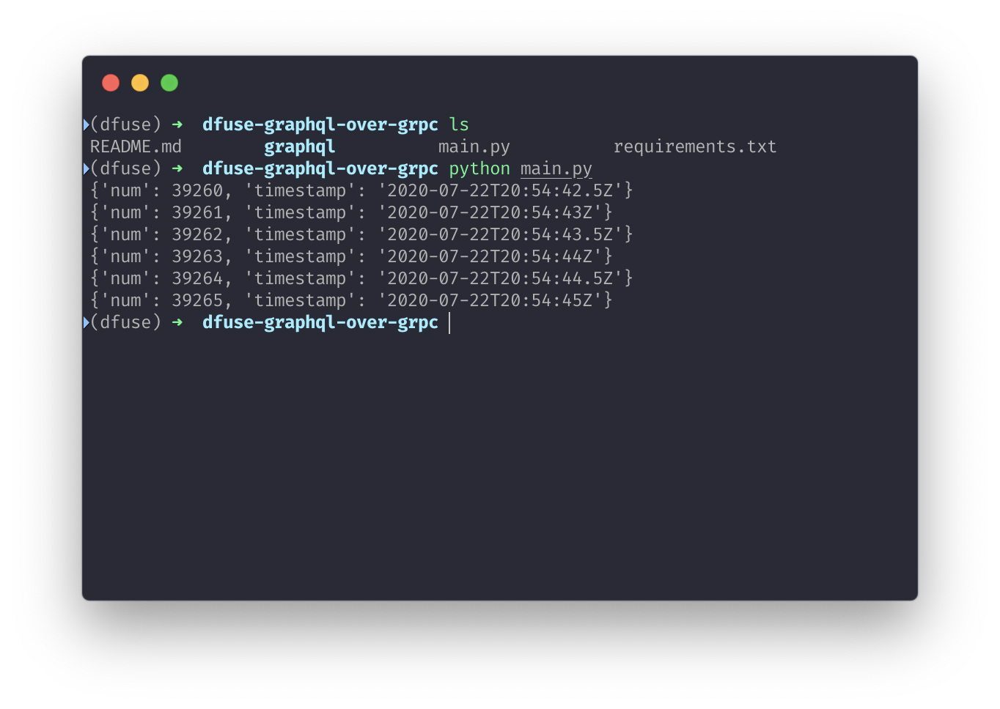

# dfuse GraphQL over gRPC Example in Python

This simple application shows you how to connect to a local dfuseeos node and make GraphQL queries over gRPC in Python.

```
pip install -r requirements.txt
python main.py
```



The graphql code is generated from https://github.com/dfuse-io/graphql-over-grpc using commands:

```
python -m grpc_tools.protoc -I. --python_out=. --grpc_python_out=. graphql/graphql.proto
```
